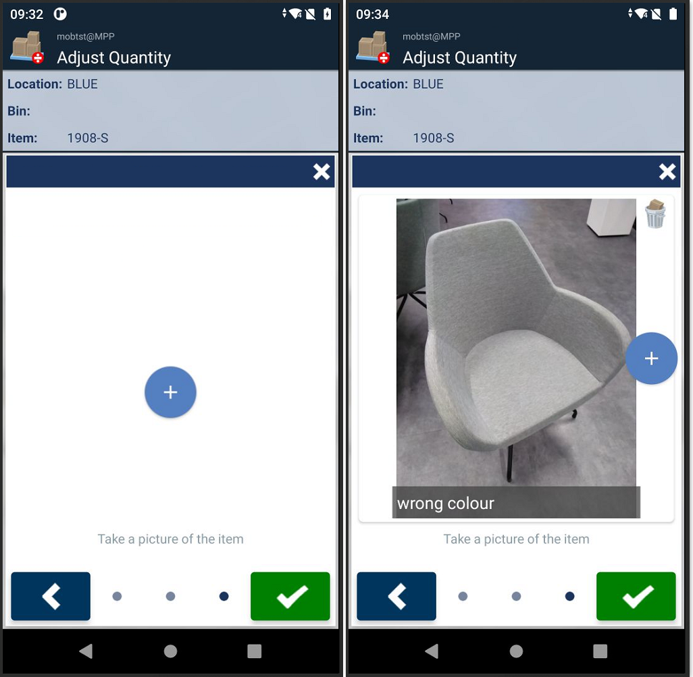
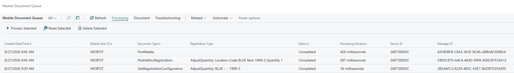
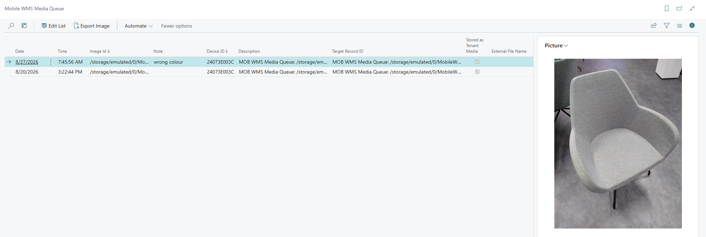

# Add ImageCapture Step to Adjust Quantity (EX-0009)

Adds an ImageCapture registration step to the Adjust Quantity unplanned function. After the user accepts the header, they are prompted to take a picture before the registration is posted. The collected image is saved in the Mob WMS Media Queue.

## Scenario

A warehouse wants photographic evidence when quantities are manually adjusted on the mobile device — for example, to document the physical state of goods or justify the correction. The image must be stored in Business Central for later review.

## Behavior on the device

When the user starts an Adjust Quantity registration, an ImageCapture step appears as part of the registration right after the header is accepted, before the registration is posted. The user takes a picture (with an optional note). A PostMedia request is created in the Mobile Document Queue, and once processed, the image appears in the Mob WMS Media Queue in Business Central.

*The ImageCapture step — prompting the user to take a picture (left) and after the picture has been captured (right).*

*The full request sequence in the Mobile Document Queue: `GetRegistrationConfiguration` (adds the step), `PostAdhocRegistration` (posts the adjustment), and `PostMedia` (uploads the captured image).*

*The captured image stored in the Mob WMS Media Queue.*

## What this example implements

Source: [Add ImageCapture step to Adjust Quantity.al](../src/Add%20ImageCapture%20step%20to%20Adjust%20Quantity.al)

| Step | Event | Purpose |
|------|-------|---------|
| 1 | `OnGetRegistrationConfiguration_OnAddSteps` on `MOB WMS Adhoc Registr.` | Adds an ImageCapture step to the registration configuration, filtered to Adjust Quantity by registration type |
| 2 | `OnPostAdhocRegistration_OnAfterPost` on `MOB WMS Adhoc Registr.` | Reads the captured image reference after posting and registers it in the Mob WMS Media Queue |

**Step 1** uses `OnGetRegistrationConfiguration_OnAddSteps`, which fires when the device requests the registration configuration — right after the user accepts the header and before the registration is posted. Both events fire for **all unplanned functions** — the registration type filter (`MobWmsToolbox."CONST::AdjustQuantity"()`) is what limits them to Adjust Quantity. Change the constant to target a different unplanned function.

> Registration steps require `useRegistrationCollector="true"` in the device's `application.cfg`. If it is `false`, the device goes straight to posting after the header and `OnGetRegistrationConfiguration_OnAddSteps` never fires — use posting steps (`OnPostAdhocRegistration_OnAddSteps`) instead.

**Step 2** uses `OnAfterPost` (fires after BC processes the registration) rather than a pre-posting event. It calls `RegisterImageCaptureInMediaQueue` with a **blank** first parameter, so no source record is recorded and no target is derived — the images stay only in the Mob WMS Media Queue.

The first parameter accepts a `Record`, `RecordId`, or `RecordRef` (or a reference ID as text) to use as the source (`Record ID`). The target (`Target Record ID`) is then derived from that source during this registration, and the image data arrives later in separate PostMedia requests that attach it to the derived target. The supported source-to-target mappings are listed in [Attach Image](https://taskletfactory.atlassian.net/wiki/spaces/TFSK/pages/78949021/Attach+Image).

For example, you could pass the Item Ledger Entry created by this posting. Standard code has no attachment support for an Item Ledger Entry, so you would implement the storage logic yourself by subscribing to:

- [OnRegisterImageCapture_OnBeforeMediaQueueInsert](https://taskletfactory.atlassian.net/wiki/x/BwB8hQ)
- [OnPostMedia_OnBeforeHandleMedia](https://taskletfactory.atlassian.net/wiki/x/EgCAhQ)

## Requirements

- Android App 1.8.1.1 or later

## Object numbers

| Object | Number | Name |
|--------|--------|------|
| Codeunit | 75001 | `AdjustQty_ImageCaptureStep` |

Renumber and rename objects before using this in a production environment.

## See also

- [How-to: Add steps to an unplanned function](https://taskletfactory.atlassian.net/wiki/spaces/TFSK/pages/2114813957/How-to+Add+steps+to+an+unplanned+function)
- [OnGetRegistrationConfiguration_OnAddSteps](https://taskletfactory.atlassian.net/wiki/spaces/TFSK/pages/78945119/OnGetRegistrationConfiguration_OnAddSteps)
- [OnPostAdhocRegistration_OnAfterPost](https://taskletfactory.atlassian.net/wiki/spaces/TFSK/pages/78951950)
- [Adjust Quantity](https://taskletfactory.atlassian.net/wiki/spaces/TFSK/pages/78948314)
- [Collector Step ImageCapture](https://taskletfactory.atlassian.net/wiki/spaces/TFSK/pages/78942253)
- [Attach Image](https://taskletfactory.atlassian.net/wiki/spaces/TFSK/pages/78949021/Attach+Image)
