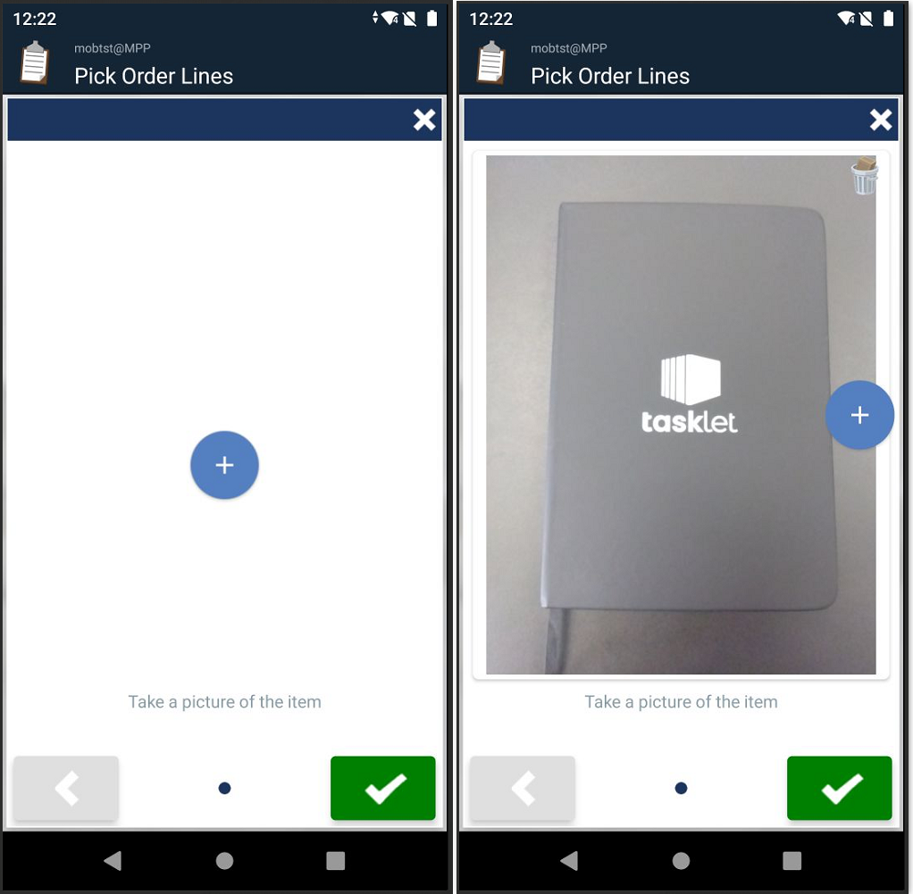
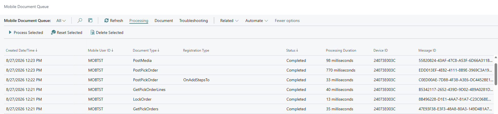
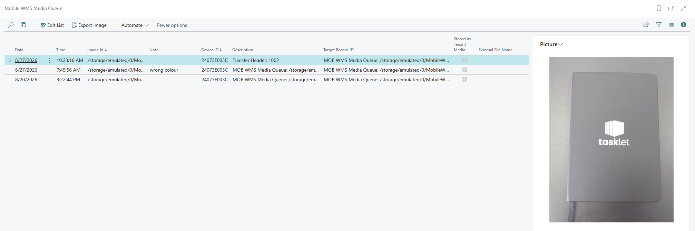

# Add ImageCapture Header Step to Pick (EX-0008)

Interrupts posting in Pick and prompts the mobile user to take a picture before the order is posted. The collected image is saved in the Mob WMS Media Queue.

## Scenario

A warehouse manager wants photo documentation of items at the point of picking — for example, to capture damage, quantity evidence, or label verification. The image must be linked to the pick order and stored for later review.

## Behavior on the device

When the user posts a pick, an extra step appears asking them to take a picture (with an optional note). Posting resumes after the image is captured. A PostMedia request is created in the Mobile Document Queue, and once processed, the image appears in the Mob WMS Media Queue in Business Central.

## What this example implements

Source: [Add ImageCapture step to Pick.al](../src/Add%20ImageCapture%20step%20to%20Pick.al)

| Step | Event | Purpose |
|------|-------|---------|
| 1 | `OnPostPickOrder_OnAddStepsToAnyHeader` on `MOB WMS Pick` | Injects an ImageCapture step into the Pick posting flow for all Pick document types |
| 2 | `OnPostPickOrder_OnBeforePostAnyOrder` on `MOB WMS Pick` | Reads the captured image reference and registers it in the Mob WMS Media Queue |

**Step 1** uses the `Any` variant, which fires for all Pick document types (Warehouse Pick, Inventory Pick, Sales Order, Transfer Order, Purchase Return). To target only one document type, use the typed variant instead — for example, `OnAddStepsToWarehouseActivityHeader`.

**Step 2** uses `OnBeforePostAnyOrder` and checks `RecordRef.Number` to identify the document type before extracting the typed record with `SetTable`.

The reference record passed to `RegisterImageCaptureInMediaQueue` is stored as the source (`Record ID`) on the Media Queue entry, and the target (`Target Record ID`) is derived from that source during this registration. The first parameter accepts a `Record`, `RecordId`, or `RecordRef` (or a reference ID as text). The image data arrives later in separate PostMedia requests that attach it to the already-derived target. The supported source-to-target mappings are listed in [Attach Image](https://taskletfactory.atlassian.net/wiki/spaces/TFSK/pages/78949021/Attach+Image).

Some record types have no attachment support in BC (for example Transfer Header). To provide your own attachment logic for those, subscribe to:

- [OnRegisterImageCapture_OnBeforeMediaQueueInsert](https://taskletfactory.atlassian.net/wiki/x/BwB8hQ)
- [OnPostMedia_OnBeforeHandleMedia](https://taskletfactory.atlassian.net/wiki/x/EgCAhQ)

## Requirements

- Android App 1.8.1.1 or later

## Object numbers

| Object | Number | Name |
|--------|--------|------|
| Codeunit | 75000 | `Pick_ImageCaptureStep` |

Renumber and rename objects before using this in a production environment.

## Screenshots

*The ImageCapture step — prompting the user to take a picture (left) and after the picture has been captured (right).*

*The request sequence in the Mobile Document Queue: the first `PostPickOrder` returns the ImageCapture step, the second `PostPickOrder` posts the pick, and `PostMedia` uploads the captured image.*

*The captured image stored in the Mob WMS Media Queue.*

## See also

- [How-to: Add header steps to a planned function](https://taskletfactory.atlassian.net/wiki/spaces/TFSK/pages/78943507/How-to+Add+header+steps+to+a+planned+function)
- [OnPostPickOrder_OnAddStepsTo... (event reference)](https://taskletfactory.atlassian.net/wiki/spaces/TFSK/pages/78952077)
- [OnPostPickOrder_OnAddStepsToAnyHeader](https://taskletfactory.atlassian.net/wiki/spaces/TFSK/pages/78952403)
- [Collector Step ImageCapture](https://taskletfactory.atlassian.net/wiki/spaces/TFSK/pages/78942253)
- [Attach Image](https://taskletfactory.atlassian.net/wiki/spaces/TFSK/pages/78949021/Attach+Image)
