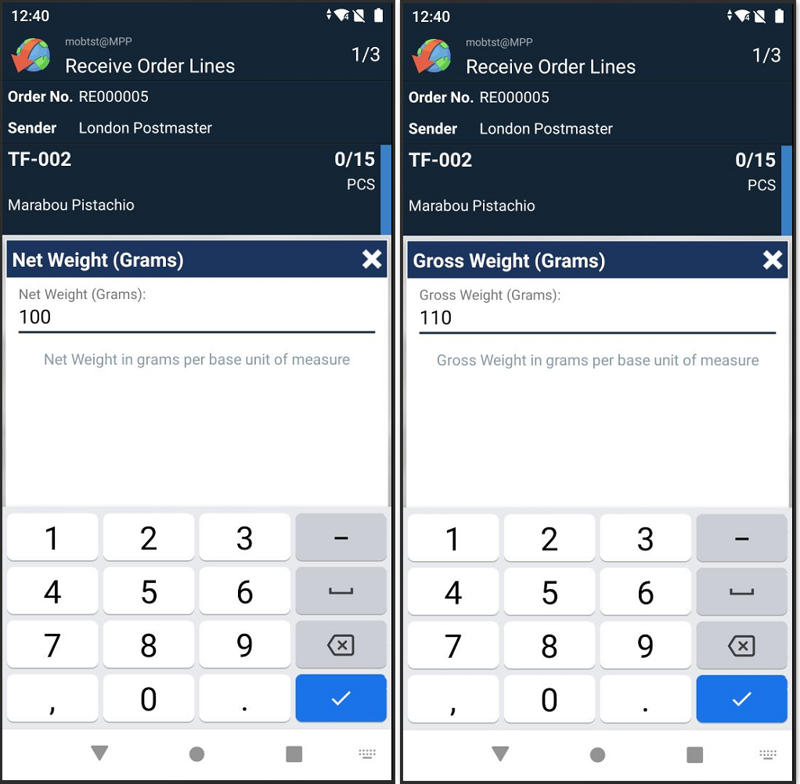
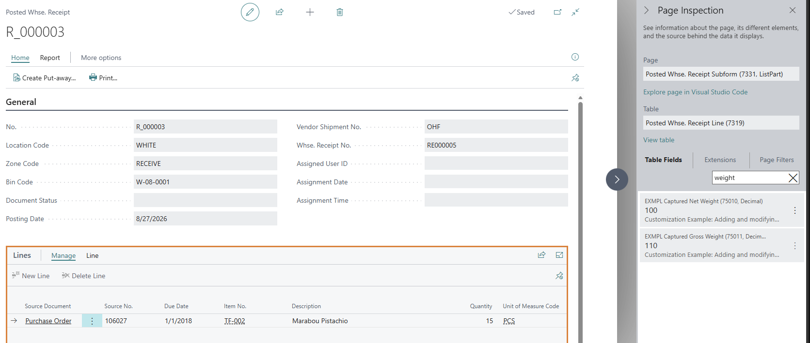

# Add Line Steps to Capture Item Weights in Receive (EX-0007)

Adds two decimal line steps to the Warehouse Receipt flow, prompting the mobile user to enter Net Weight and Gross Weight for each item during registration. The captured values are saved to the posted receipt and used to update the Item Card during posting.

## Scenario

A warehouse wants to populate missing Item Card weight data at the point of receiving goods. Mobile users enter the weight in grams per base unit of measure for each line. The values are written to the Item Card when the receipt is posted.

> **Note:** Overwriting Item Card weights on every receipt is used here as a demonstration of what you can do with captured values in a posting event. Replace this with whatever logic fits your scenario.

## Behavior on the device

When the user registers a Warehouse Receipt line, two extra steps appear — one for Net Weight and one for Gross Weight. Both fields support on-device calculation. After posting, the captured values appear on the Posted Whse. Receipt Line and are written to the Item Card.

## What this example implements

Source: [Add line steps to capture weight in Receive.al](../src/Add%20line%20steps%20to%20capture%20weight%20in%20Receive.al)

| Step | Event | Purpose |
|------|-------|---------|
| 1 | `OnGetReferenceData_OnAddRegistrationCollectorConfigurations` on `MOB WMS Reference Data` | Defines two decimal steps (Net Weight, Gross Weight) under the key `CustomWeightSteps` |
| 2 | `OnGetReceiveOrderLines_OnAddStepsToAnyLine` on `MOB WMS Receive` | Attaches `CustomWeightSteps` to Warehouse Receipt lines (guards on `RecordRef.Number` to skip other document types) |
| 3 | `OnPostReceiveOrder_OnHandleRegistrationForWarehouseReceiptLine` on `MOB WMS Receive` | Reads collected values and stores them on the Warehouse Receipt Line in custom fields |
| 4 | `OnBeforeCreatePostedRcptLine` on `Whse.-Post Receipt` | Explicitly copies the values to the Posted Whse. Receipt Line and updates the Item Card — fires once per line |

Reference Data steps (Step 1) are defined once and can be reused across multiple flows and document types.

## Supporting objects

Two table extensions add storage fields to hold the captured values between registration and posting:

| Object | Number | Extends |
|--------|--------|---------|
| Table extension | 75010 | `Warehouse Receipt Line` |
| Table extension | 75011 | `Posted Whse. Receipt Line` |

The fields are copied explicitly in Step 4 (`OnBeforeCreatePostedRcptLine`).

## Requirements

- Extension version MOB5.23 or later

## Object numbers

| Object | Number | Name |
|--------|--------|------|
| Codeunit | 75010 | `Receive_LineStepsItemWeights` |
| Table extension | 75010 | `EXMPL Warehouse Receipt Line` |
| Table extension | 75011 | `EXMPL Posted Whse. Rcpt. Line` |

Renumber and rename objects before using this in a production environment.

## Screenshots

*The two decimal line steps during registration: Net Weight (left) and Gross Weight (right), entered in grams per base unit of measure.*

*The captured Net Weight and Gross Weight stored on the Posted Whse. Receipt Line (shown via Page Inspection).*

## See also

- [How-to: Add line steps to a planned function](https://taskletfactory.atlassian.net/wiki/spaces/TFSK/pages/78943503/How-to+Add+line+steps+to+a+planned+function)
- [OnGetReferenceData_OnAddRegistrationCollectorConfigurations](https://taskletfactory.atlassian.net/wiki/spaces/TFSK/pages/78943993)
- [OnGetReceiveOrderLines_OnAddStepsToAnyLine](https://taskletfactory.atlassian.net/wiki/spaces/TFSK/pages/78943206)
- [OnPostReceiveOrder_OnHandleRegistrationForWarehouseReceiptLine](https://taskletfactory.atlassian.net/wiki/spaces/TFSK/pages/78951941)
