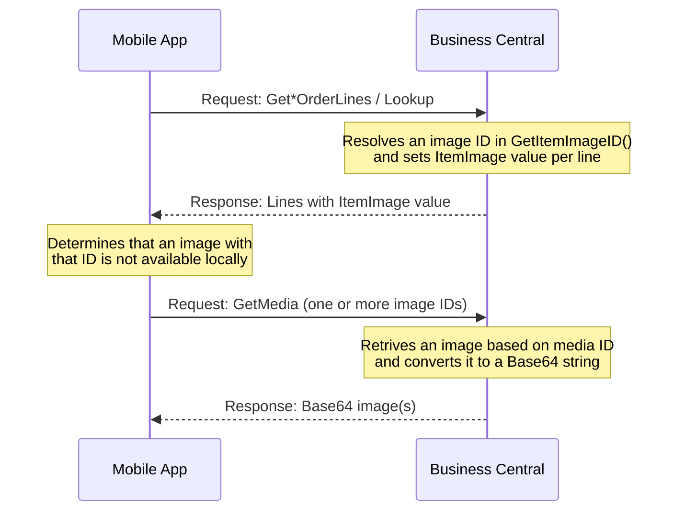

# Item Image From Alternative Storage

This example demonstrates how to customize item image handling in Tasklet Mobile WMS when item images are stored outside the standard Business Central Item Picture field.<br/>
It shows how to control image ID resolution and how to serve image content from an external source.

## Use case

A warehouse operator handles items in Mobile WMS and expects to see the correct product image to support fast and accurate work.<br/>
In this scenario, the company stores product images externally — for example in a CDN, blob storage, or shared file server — rather than as Business Central tenant media records. This extension ensures item images are still shown in Mobile WMS by resolving custom image IDs and serving image content from the external source.

## How it works

Mobile WMS resolves and displays item images in two steps:

1. Business Central returns a value in line element `ItemImage` in `BaseOrderLine` and `LookupResponse` responses. The `ItemImage` value uniquely identifies the product image. See [XML reference examples](#xml-reference-examples) below.
2. The mobile app checks whether an image with that ID is already available locally; if not, it sends a `GetMedia` request to the backend for an image with that ID.



### Important to know about `GetMedia`
The `GetMedia` request is shared across different media types, not only item images. It is vital that the media ID indicates what type of media it is.
We recommend constructing media IDs with a clear, solution-unique prefix so your extension can reliably identify which requests it should handle and which to leave alone.

### Important to know about caching behaviour
The mobile app will not request an image from Business Central if the device already has an image with the specified ID.
To force a new fetch after an image has changed, you must provide a new ID for the item image - for example by including a version token (timestamp, last-modified value, ETag, or content hash).
If the ID does not change, the app assumes the local image is still valid and skips GetMedia, showing an old version of the image to the mobile user.
See [How to create version tokens](#how-to-create-version-tokens) below.

## What this example implements

The codeunit demonstrates three events in the `MOB WMS Media` codeunit, scoped to item number `SPACESHIP`:

| Event | Variant | Behavior |
|---|---|---|
| `OnBeforeGetItemImageID` | `GREEN` | Builds an image ID from item number, variant, and a content hash; sets it before default resolution runs |
| `OnAfterGetItemImageID` | `ORANGE` | Builds an image ID from item number, variant, and a content hash; overrides the result after default resolution has run |
| `OnGetMedia_OnBeforeAddImageToMedia` | Both | Constructs the image URL from item number and variant, fetches the image, and returns it as base64 |

### Image ID design

The image ID connects both steps of the image flow, and its structure is driven by the two constraints described above:

- **`GetMedia` is shared across all media types.** The ID is prefixed with `ItemImageFromUrl` so the handler can reliably identify which requests belong to it and ignore the rest. Replace this prefix with one that is unique to your solution.

- **The mobile app caches images by ID.** If the ID does not change when an image changes, the app will continue showing the old version. To force a re-fetch, the ID must change with the image. This example embeds a version token — a truncated SHA-256 content hash computed by fetching the image at the time the ID is built.

The resulting format is: `ItemImageFromUrl_<ItemNo>_<VariantCode>_<VersionToken>`

The `OnGetMedia_OnBeforeAddImageToMedia` handler only processes IDs matching this structure. It also verifies that the content hash still matches the fetched image before returning it, ensuring the served image is consistent with the ID that was issued.

### Adapting to your solution

The ID format and the content hash approach are choices made to keep this example self-contained. The right approach depends on how images are managed in your solution — for alternatives, see [How to resolve the image location](#how-to-resolve-the-image-location) and [How to create version tokens](#how-to-create-version-tokens).

## How to resolve the image location

To retrieve the image in `GetMedia`, your extension needs to know where to find it. The right approach depends entirely on how images are managed in your customer's solution. The following are suggestions — they are not exhaustive, and the best fit will vary.

- **Constructed from item data**  
  Build the image location reference from known item attributes such as item number and variant code, using a fixed pattern or naming convention agreed with the external storage. This requires no additional storage in Business Central, but assumes a predictable structure. This is the approach used in this example: the URL is constructed as `{BaseUrl}/{ItemNo}_{VariantCode}.png`.

- **Stored on the Item record**  
  Add a field to the Item or Item Variant table that holds the image reference (for example a URL, file path, or storage key). This is flexible and explicit, but requires a table extension and a process for keeping the reference up to date.

- **Stored in a custom mapping table**  
  Maintain a dedicated table mapping item number and variant to image references. This keeps the Item table clean and supports more complex mappings, but requires more setup.

- **Resolved via an external API**  
  Call an external service at runtime to look up the image reference for a given item. This can avoid the need to store references in Business Central, but adds an HTTP request per line and a dependency on the external service.

## How to create version tokens

Because Mobile WMS uses the image ID for cache validation, the ID should include a version marker that changes when the image changes. The version marker can be created in different ways depending on where the image is stored and which system is considered the source of truth.

Note that strategies based on external storage all require an HTTP request to the external system when building the image ID — once per order line or lookup result. The only strategies that avoid this are those where the version value comes from Business Central itself.

- **Last-modified timestamp from external storage**  
  Use the image's last update datetime from CDN, blob, or file metadata. This is simple and readable, but requires an HTTP request per line to fetch the metadata.

- **ETag from external storage**  
  Use the storage provider's ETag value, or a shortened form of it. This is designed for change detection and is often reliable, but requires an HTTP request per line to fetch the metadata.

- **Content hash**  
  Generate a hash from the image content, for example SHA-256 or MD5. This gives exact change detection, but requires an HTTP request per line to fetch the image content. This is the approach used in this example.

- **Business Central change tracking fields**  
  Store the external image reference in Business Central and use a field such as `ModifiedAt`, rowversion, or another maintained value. This avoids any external HTTP requests when building the image ID, but requires a table design that is kept in sync with image changes.

- **Manual version number**  
  Maintain a version number in Business Central and increment it when the image is replaced. This is simple and efficient, avoids external HTTP requests, but depends on process discipline.

The right choice depends on where the image is stored and which system is considered the source of truth.

## XML reference examples

Elements not relevant to the item image flow are omitted for clarity.

### `BaseOrderLine` response with ItemImage
The ItemImage value in this example shows how Mobile WMS constructs the image id. Construct the ID in your extension, so the image can be identified and returned in a `GetMedia` request.

```xml
<response xmlns="http://schemas.microsoft.com/Dynamics/Mobile/2007/04/Documents/Response" status="Completed">
    <responseData xmlns="http://schemas.taskletfactory.com/MobileWMS/BaseDataModel">
        <BaseOrderLine>
            <ItemNumber>1936-S</ItemNumber>
            <ItemImage>24-01-2026 09:12:44.203Item: 1936-S</ItemImage>
            <!-- other BaseOrderLine elements omitted for clarity -->
        </BaseOrderLine>
    </responseData>
</response>
```

### `LookupResponse` response with ItemImage
The ItemImage value in this example shows how Mobile WMS constructs the image id. Construct the ID in your extension, so the image can be identified and returned in a `GetMedia` request.

```xml
<response xmlns="http://schemas.microsoft.com/Dynamics/Mobile/2007/04/Documents/Response" status="Completed">
    <responseData xmlns="http://schemas.taskletfactory.com/MobileWMS/WarehouseInquiryDataModel">
        <LookupResponse>
            <ItemNumber>1988-S</ItemNumber>
            <ItemImage>23-01-2026 03:45:16.057Item: 1988-S</ItemImage>
            <!-- other LookupResponse elements omitted for clarity -->
        </LookupResponse>
    </responseData>
</response>
```

### `GetMedia` request with two mediaIds (images)  

```xml
<request name="GetMedia" xmlns="http://schemas.microsoft.com/Dynamics/Mobile/2007/04/Documents/Request">
    <requestData name="GetMedia">
        <mediaIds>
            <image>23-01-2026 03:45:16.057Item: 1988-S</image>
            <image>24-01-2026 09:12:44.203Item: 1960-S</image>
        </mediaIds>
        <!-- other request elements omitted for clarity -->
    </requestData>
</request>
```

### `GetMedia` response with two media images (Base64)

```xml
<response xmlns="http://schemas.microsoft.com/Dynamics/Mobile/2007/04/Documents/Response" messageid="B08C7C89-2D03-4DD4-98A8-A4E42985861D" status="Completed">
  <description />
  <responseData>
    <media>
      <image id="23-01-2026 03:45:16.057Item: 1988-S">/9j/4AAQSkZJRgABAQEAYABgAAD/2wBDAAQCAwMDAgQDAwMEBAQEBQkGBQUFBQsICAYJDQsNDQ0LDAwO...image data is limited to save storage space</image>
      <image id="24-01-2026 09:12:44.203Item: 1960-S">/9j/4ABQSkZJRgABAQEAZABhAAD/2wBDAAQCAwMDAgQDAwMEBAQEBQkGBQUFBQsICAYJDQsNDQ0LDAwO...image data is limited to save storage space</image>
    </media>
  </responseData>
</response>
```

## Object numbers and prefix

Please renumber and rename the objects before using this code in a production environment.

Also replace the image ID prefix `ItemImageFromUrl` with a prefix unique to your solution. The prefix is used to identify which `GetMedia` requests your extension should handle, so it must not collide with prefixes used by other extensions.

## Disclaimer

This example extension is provided as-is. Please carefully validate and test the code and any solution built from it. The code is not supported to the same degree as Mobile WMS, but we aim to keep it up to date as Business Central and Mobile WMS evolve.

Please report bugs directly in GitHub.