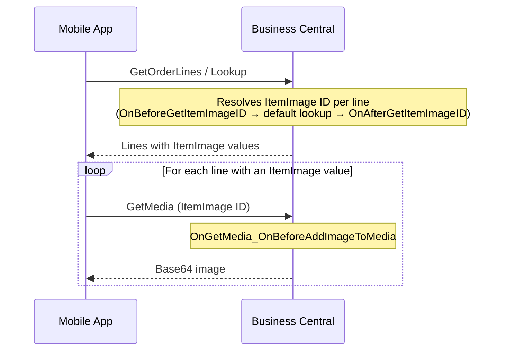

# 🖼️ Customization Example: Change ImageID

This extension demonstrates how to use event handlers to customize the process of retrieving item images in **Tasklet Mobile WMS** for Microsoft Dynamics 365 Business Central.

---

## 📖 Overview

When the Mobile WMS app requests an item image, it fires a series of events that allow you to intercept and override the image being returned. This example shows how to hook into those events to supply a custom image based on the item variant code.

---

## ⚡ Events Covered

### 🔵 `OnBeforeGetItemImageID`

Fires **before** the default image ID lookup runs. Set `_ItemImageID` and mark `_IsHandled := true` to skip the default logic entirely.

| Parameter | Type | Description |
|---|---|---|
| `_ItemNo` | `Code[20]` | The item number being looked up |
| `_VariantCode` | `Code[10]` | The variant code being looked up |
| `_ItemImageID` | `Text` | Set this to your custom image ID |
| `_IsHandled` | `Boolean` | Set to `true` to prevent default logic from running |

---

### 🟢 `OnAfterGetItemImageID`

Fires **after** the default image ID lookup runs. Use this to override or supplement the result without blocking the default logic.

| Parameter | Type | Description |
|---|---|---|
| `_ItemNo` | `Code[20]` | The item number that was looked up |
| `_VariantCode` | `Code[10]` | The variant code that was looked up |
| `_ItemImageID` | `Text` | Override this to change the final image ID |

---

### 🎨 `OnGetMedia_OnBeforeAddImageToMedia`

Fires when the app is about to attach an image to a media object. Use this to supply a **base64-encoded image** for any custom image ID you have provided via the events above.

| Parameter | Type | Description |
|---|---|---|
| `_MediaID` | `Text` | The image ID that was resolved |
| `_ScreenHeight` | `Integer` | The screen height of the requesting device |
| `_ScreenWidth` | `Integer` | The screen width of the requesting device |
| `_Base64Media` | `Text` | Set this to a base64-encoded image string |
| `_IsHandled` | `Boolean` | Set to `true` to prevent default logic from running |

---

### 🔄 Image Loading Flow

Each `GetMedia` call is fired ad-hoc after the lines are received, so images load one by one as responses come back.

## 💡 Example Logic

The codeunit in this extension provides three simple examples, all scoped to item **`SPACESHIP`**:

- 🟢 **`GREEN` variant** — The image ID (`GreenSpaceshipMediaID`) is set in `OnBeforeGetItemImageID`, which prevents the default lookup from running.
- 🟠 **`ORANGE` variant** — The image ID (`OrangeSpaceshipMediaID`) is set in `OnAfterGetItemImageID`, which overrides the result after the default lookup.
- 🌐 **Custom images** — When the resolved image ID is `GreenSpaceshipMediaID` or `OrangeSpaceshipMediaID`, `OnGetMedia_OnBeforeAddImageToMedia` fetches the corresponding PNG from a GitHub raw URL and returns it as base64.

> These examples are scoped to item **`SPACESHIP`** — only that item's variants will trigger the custom image logic.

---

## 📦 Dependencies

| Publisher | Extension | Minimum Version |
|---|---|---|
| Tasklet Factory | Tasklet Mobile WMS | 5.66.0.0 |

---

## Object numbers and prefix

Please renumber and rename the objects before using this code in a production environment.

# Disclaimer

This example extension is provided as-is. Please carefully validate and test the code and any solution built from it. The code is not supported to the same degree as Mobile WMS, but we aim to keep it up to date as Business Central and Mobile WMS evolve.

Please report bugs directly in GitHub.