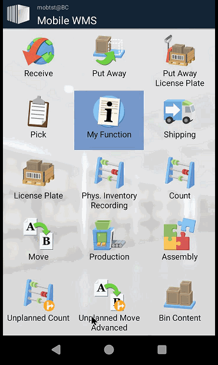

# 📦 Custom Planned Function: Sales Order Picking for Mobile WMS

This repository contains two examples of a **custom Planned Function** for Mobile WMS in Dynamics 365 Business Central.

## 🚀 Examples Included

### 1. Functional Example
The active example demonstrates how to register `"Qty. To Ship"` on basic **Sales Order Picking** documents.

### 2. Barebones Example
A minimal illustrative version that demonstrates the mobile logic without enhancements. Intended for educational purposes or as a starting point for custom development.

## ⚠️ Important Notes

- **Do NOT use both examples simultaneously.**
- After publishing your Planned Function, you **must run** the action **"Create Document Types"** in **Mobile WMS Setup**.  
  This step is required to generate the necessary Mobile Messages and Mobile Document Types.
- For best practices and deeper integration, refer to the source code (https://university.taskletfactory.com/) in the following Codeunits:
  - `MOB WMS Receive`
  - `MOB WMS Pick`

 

## Example

## Disclaimer
This example extension is provided as-is, so please carefully validate and test the code and any solution built from it. The code is not supported to the same degree as Mobile WMS, but we aim to keep it up to date as Business Central and Mobile WMS evolve.

Please report bugs directly in GitHub.