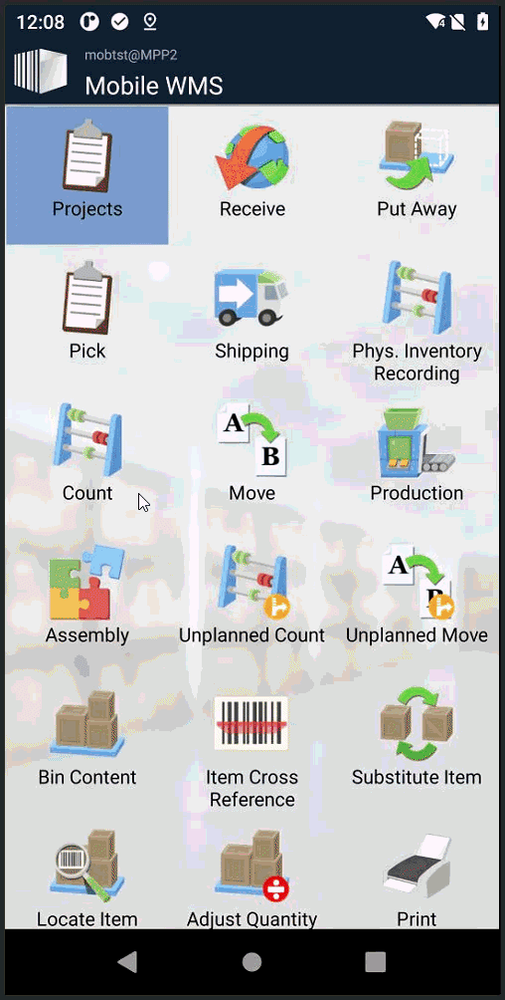

# Project Item Posting - Lookup with Unplanned item registration

This example shows how to combine a **custom lookup** with **Unplanned Item Registration** in Mobile WMS to look up Projects and post Item Consumptions and Item Returns via the Project Journal.

## Use case

A warehouse operator needs to register item consumption or item returns against a specific Project directly from the Mobile WMS main menu — without being in a document flow. They can search for a Project or scan a GS1 barcode to populate Project No. and Project Task No. in a single scan, then scan an item and post the quantity directly from the device.

## What this example implements

The UI is configured using a **configuration tweak** — an XML snippet distributed from AL to the Mobile App at login. This is the recommended approach for adding pages and actions without modifying the base configuration files.

The tweak (`resources/ProjectItemPostingTweak.xml`) defines:
- A **Project lookup page** (`ProjectItemPosting`) of type `Lookup` — lets the operator search for and select a Project
- Two **Unplanned Function pages** (`ProjectItemConsumption` and `ProjectItemReturn`) of type `UnplannedItemRegistration`
- A **menu item** in the main menu that opens the Project lookup

The integration is implemented across the following AL files:

| File | Role | Description |
|:---|:---|:---|
| `MOB Setup.TableExt.al` / `MOB Setup.PageExt.al` | **Setup** | Extends the Mobile WMS Setup table and page with fields for Project Journal Template, Batch Name, and Project Line Type |
| `ProjectItemPosting_CreateSetupData.Codeunit.al` | **Create Setup Data** | Creates the menu option and message records for page/action title placeholders, with xlf translation support |
| `ProjectItemPosting_GetReferenceData.Codeunit.al` | **Distribute Tweak & Header Fields** | Distributes the tweak XML to the Mobile App at login, and defines the header fields for the lookup page (Project Search) and both registration pages (Project No., Project Task No., Location, Item Number) |
| `ProjectItemPosting_Lookup.Codeunit.al` | **Handle Lookup** | Returns the list of open, unblocked Projects when the operator opens the Project search page |
| `ProjectItemPosting_GetRegistrationConfiguration.Codeunit.al` | **Define Steps** | Defines the input steps shown on the registration pages — Project Task No. (if not provided in the header), Variant, Bin, Unit of Measure, Quantity, and item tracking |
| `ProjectItemPosting_PostAdhocRegistration.Codeunit.al` | **Handle Registration** | Posts the collected values as a Project Journal line; for consumption, validates bin content and confirms with the operator if recent entries exist for the same Project and Item |

## GS1 Barcode Support

The header fields for Project No. and Project Task No. are configured with custom GS1 Application Identifiers (AIs):

- AI `92` → maps to the **Project No.** header field (`ProjectNo`)
- AI `93` → maps to the **Project Task No.** header field (`ProjectTaskNo`)

This is done by calling `Set_eanAi('92')` and `Set_eanAi('93')` on the respective fields in `ProjectItemPosting_GetReferenceData.Codeunit.al`. When the operator scans a GS1-128 barcode containing these AIs, Mobile WMS automatically routes each value to the correct header field — so both Project No. and Project Task No. can be populated in a single scan.

Example GS1-128 barcode encoding Project No. (AI 92) and Project Task No. (AI 93):

## Setup

When the extension is installed, the menu option and Mobile Messages are created automatically.

You must manually configure the **Project Journal Template**, **Batch Name**, and **Project Line Type** on the Mobile WMS Setup page before use.

## Object numbers and prefix

Please renumber and rename the objects before using this code in a production environment.

## Disclaimer

This example extension is provided as-is. Please carefully validate and test the code and any solution built from it. The code is not supported to the same degree as Mobile WMS, but we aim to keep it up to date as Business Central and Mobile WMS evolve.

Please report bugs directly in GitHub.
