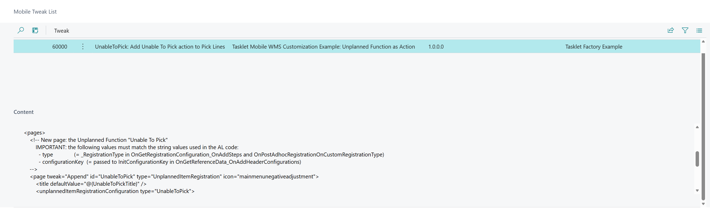
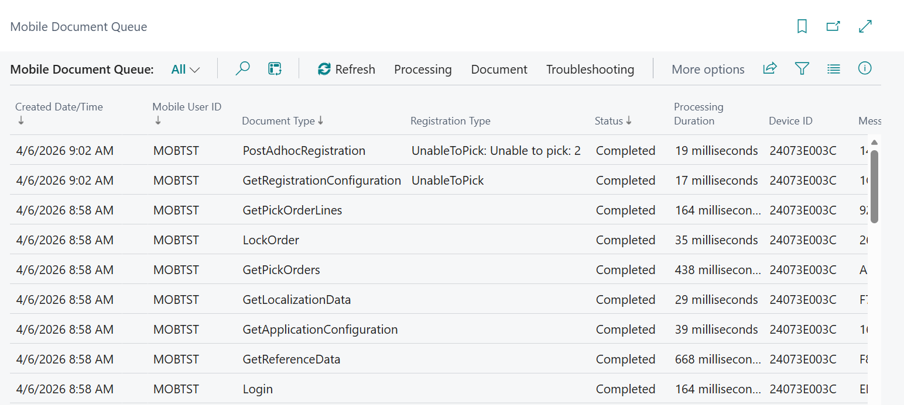

# Add Action to Order Line Menu (Unplanned Function)

This example shows how to add a custom **Unplanned Function** as an action on the Pick Order Lines page in Mobile WMS.

Based on the documentation: [How-to: Add action to Order Line menu](https://taskletfactory.atlassian.net/wiki/spaces/TFSK/pages/78951469/How-to+Add+action+to+Order+Line+menu)

## Use case

A warehouse operator is picking an order and finds they are unable to pick the full quantity of a line (e.g. damaged goods, out of stock). They need a quick way to register the shortfall directly from the Pick Lines page, without leaving the picking flow.

<video src="media/PickOrderLines_UnableToPickAction.mp4" controls width="600"></video>

## What this example implements

- One new **Unplanned Function** (`UnableToPick`)
  - One action on the **Pick Lines** page that opens this function
- Three **Header fields** transferred from the Order Line (locked, read-only):
  - `Location`
  - `FromBin`
  - `ItemNumber`
- One **Step** to collect the quantity that could not be picked
  - Defaults to the remaining unregistered quantity on the line
- A **success message** that echoes the order, line and quantity back to the user
- **Mobile Messages** for the page and action title, with translation support via xlf files

## Files

| File | Description |
|------|-------------|
| `src/UnplannedFunctionAsAction.Codeunit.al` | AL codeunit with all event subscribers (Steps 1–5) |
| `resources/UnableToPickTweak.xml` | Mobile WMS configuration tweak distributed via Step 1 |

## Implementation steps

### Step 1 — Distribute configuration tweak (AL: `OnGetApplicationConfiguration_OnAddTweaks`)

The tweak XML (`resources/UnableToPickTweak.xml`) is distributed to the Mobile App automatically from the backend using the `OnGetApplicationConfiguration_OnAddTweaks` event. It is loaded on login — configuration changes require the user to log out and back in.

The tweak defines:
- The new `UnableToPick` unplanned function page
- An action on the **Pick Lines** page that opens it

> **Requirements:** Android App 1.8.0+ and Mobile WMS 5.55+
>
> See: [OnGetApplicationConfiguration_OnAddTweaks](https://taskletfactory.atlassian.net/wiki/spaces/TFSK/pages/994050068/OnGetApplicationConfiguration_OnAddTweaks)



### Step 2 — Header fields (AL: `OnGetReferenceData_OnAddHeaderConfigurations`)

Declares the three locked header fields for the `UnableToPick` configuration key. The values are automatically populated from the Order Line context when the user opens the action.

### Step 3 — Steps (AL: `OnGetRegistrationConfiguration_OnAddSteps`)

Returns a single decimal step `UnableToPickQuantity`. The default value is calculated as:

```
Quantity (line total) − RegisteredQuantity (already registered, not yet posted)
```

### Step 4 — Handle registration (AL: `OnPostAdhocRegistrationOnCustomRegistrationType`)

Called when the user accepts. The example writes a success message using the collected values. Replace the placeholder comment with your own business logic (e.g. create a journal line, update a planning record).

### Step 5 — Mobile Messages (AL: `OnAddMessages`)

Defines the text values for the `@{UnableToPickTitle}` placeholder used in the tweak XML. Messages are created via the `OnAddMessages` event and sent to the device on Reference Data load.

This example uses AL `Label` variables so translations can be managed through standard xlf files. Alternatively, values can be hardcoded per language code using the `CreateHardcodedMessages` procedure.

Messages are created automatically when:
- **"Create Document Types"** is run from the Mobile WMS Setup page
- **"Create Messages"** is run from the Mobile Language page
- Tasklet Mobile WMS is upgraded

To ensure messages exist from first install, also create them in your own Install or Upgrade codeunit.

The following screenshot shows the complete request sequence in the Mobile Document Queue after running through the full flow — from login to the final PostAdhocRegistration:



## Object numbers and prefix

Please renumber and rename the objects before using this code in a production environment.

## Disclaimer

This example extension is provided as-is. Please carefully validate and test the code and any solution built from it. The code is not supported to the same degree as Mobile WMS, but we aim to keep it up to date as Business Central and Mobile WMS evolve.

Please report bugs directly in GitHub.
