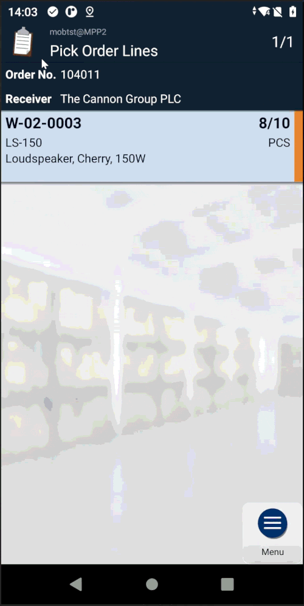
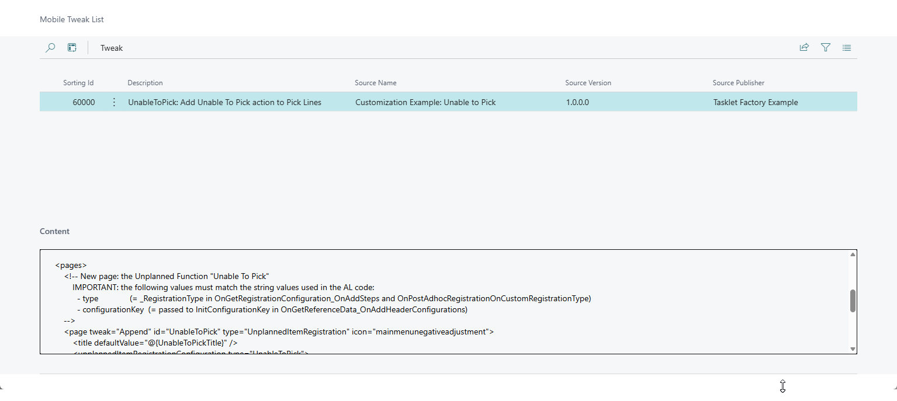

# Add Action to Order Line Menu (Unplanned Function)

This example shows how to add a custom **Unplanned Function** as an action on the Pick Order Lines page in Mobile WMS.

Based on the documentation: [How-to: Add action to Order Line menu](https://taskletfactory.atlassian.net/wiki/spaces/TFSK/pages/78951469/How-to+Add+action+to+Order+Line+menu)

## Use case

A warehouse operator is picking an order and finds they are unable to pick the full quantity of a line (e.g. damaged goods, out of stock). They need a quick way to register the shortfall directly from the Pick Lines page, without leaving the picking flow.

## What this example implements

The UI is configured using a **configuration tweak** — an XML snippet distributed from AL to the Mobile App at login. This is the recommended approach for adding pages and actions without modifying the base configuration files.

The tweak (`resources/UnableToPickTweak.xml`) defines:
- A new **Unplanned Function** page (`UnableToPick`) of type `UnplannedItemRegistration`
- An **action on the Pick Lines page** that opens it

The AL codeunit (`src/UnableToPickExample.Codeunit.al`) wires up the behaviour using five event subscribers:
- **Configuration tweak** — loads and distributes the tweak XML to the Mobile App at login (`OnGetApplicationConfiguration_OnAddTweaks`)
- **Header fields** — three read-only fields (`Location`, `FromBin`, `ItemNumber`) transferred automatically from the Order Line context (`OnGetReferenceData_OnAddHeaderConfigurations`)
- **Steps** — one decimal input defaulting to the remaining unregistered quantity (`OnGetRegistrationConfiguration_OnAddSteps`)
- **Registration handler** — called on accept; replace the placeholder with your own business logic (`OnPostAdhocRegistrationOnCustomRegistrationType`)
- **Mobile Messages** — text for the page/action title placeholders, with xlf translation support (`OnAddMessages`)

Once published, the tweak appears in the **Mobile Tweak List** (opened from the Mobile Document Queue page in BC):

The full request sequence in the Mobile Document Queue after running through the complete flow:

## Object numbers and prefix

Please renumber and rename the objects before using this code in a production environment.

## Disclaimer

This example extension is provided as-is. Please carefully validate and test the code and any solution built from it. The code is not supported to the same degree as Mobile WMS, but we aim to keep it up to date as Business Central and Mobile WMS evolve.

Please report bugs directly in GitHub.
