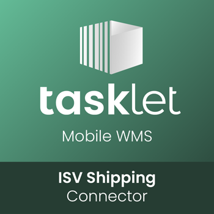

## ISV Shipping Solution

## Introduction
This extension provides a simple example of an ISV Shipping Connector

It uses the Pack & Ship API to transfer data from Pack & Ship into a simple Transport Document based on License Plates. 
Intended to be used as a base for building your own connector for any shipping provider solution.

This 'ISV Shipping Connector' must be used together with the sample 'ISV Shipping Solution' extension, also available on github. 
Please see the [Pack & Ship userguide](https://docs.taskletfactory.com/x/xQKiCQ) for more details.

## Support
•   Go to [Tasklet Docs](https://docs.taskletfactory.com/display/TFSK/Customization) for more documentation and code samples for extending Mobile WMS.

•   Go to [Tasklet University](https://university.taskletfactory.com/) for training, videos, and more resources for working with Mobile WMS.
