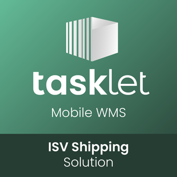

## ISV Shipping Solution

## Introduction
This 'ISV Shipping Solution' can be used together with the samlpe 'ISV Shipping Connector' extension, also avaliable on github.

This extension provide a simple Transport Document with no real functionallity. 
It contains a set of tables and pages to show a simple Transport Document and the option to setup different Package Types. 
Intended to be part of an example on how-to extend Mobile WMS and transfer data to your own extension in the Pack & Ship process.

Please see the [Pack & Ship userguide](https://docs.taskletfactory.com/x/xQKiCQ) for more details.

#### ISV Transport Document

#### ISV Package Types

## Support
•   Go to [Tasklet Docs](https://docs.taskletfactory.com/display/TFSK/Customization) as the main documentation and code sample resource for extending Mobile WMS.

•   Go to [Tasklet University](https://university.taskletfactory.com/) as the main learning resource for working with Mobile WMS.

