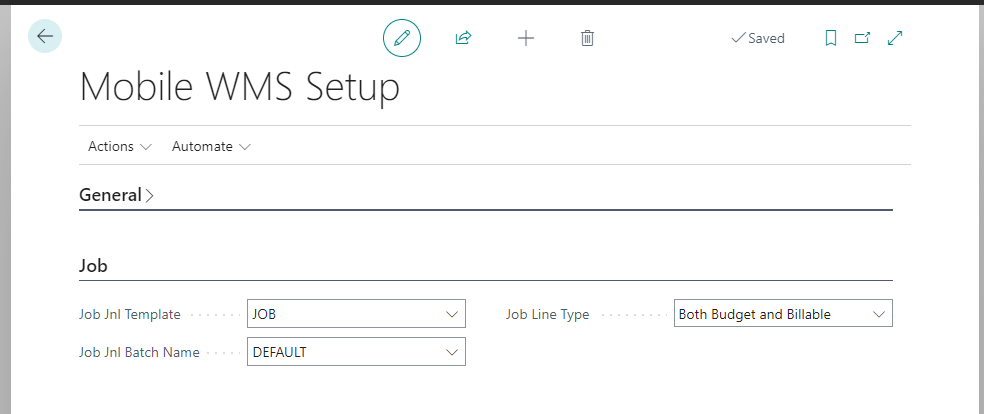
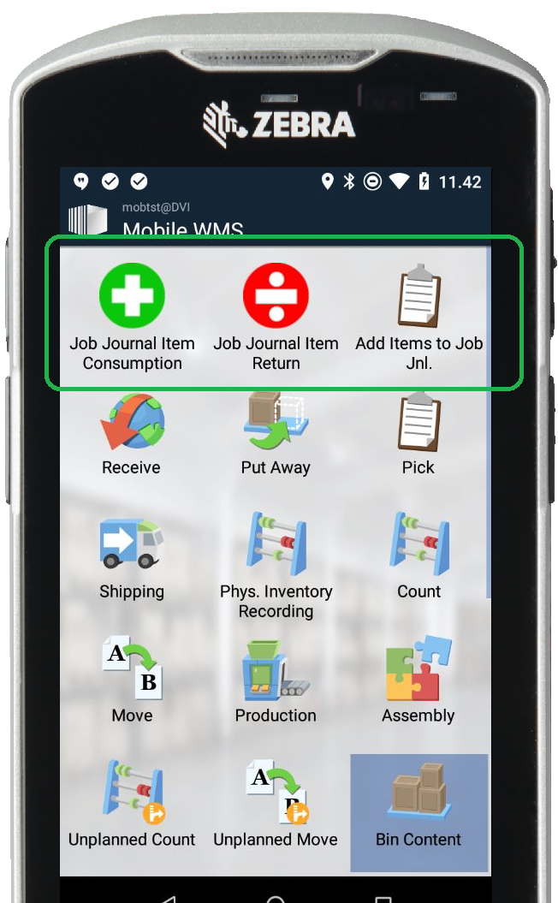
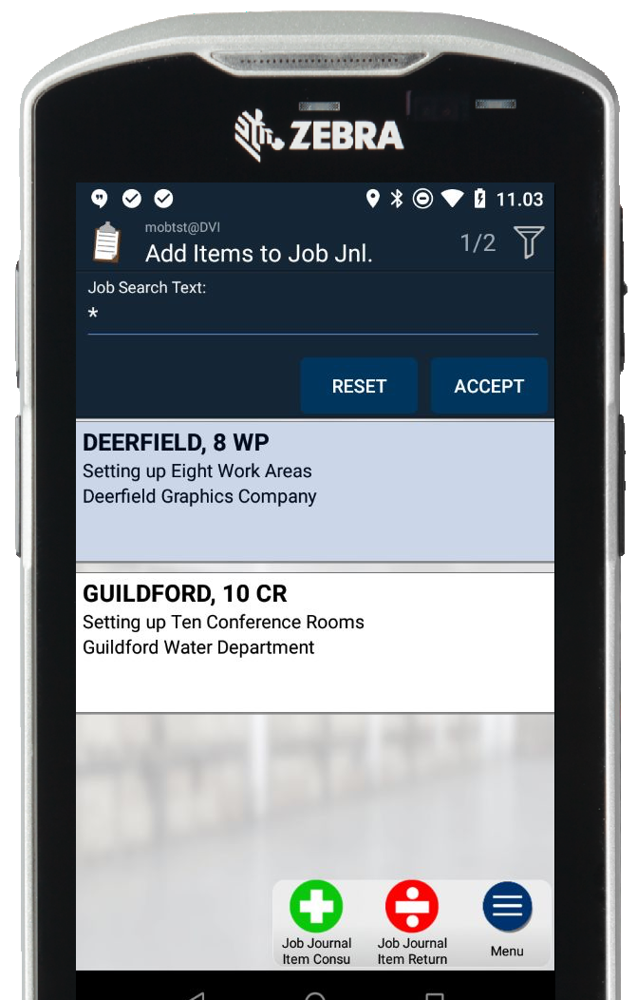
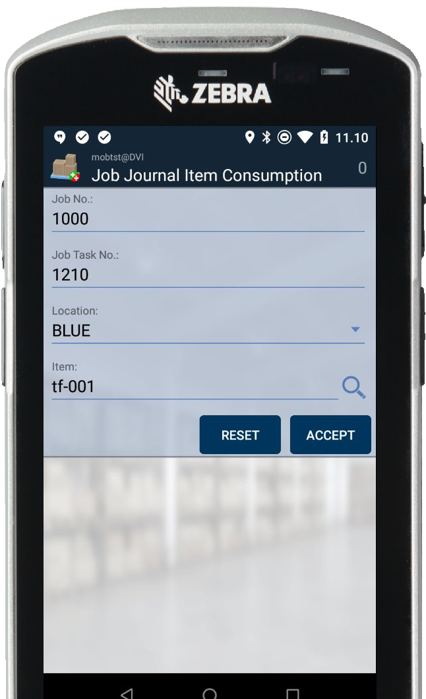
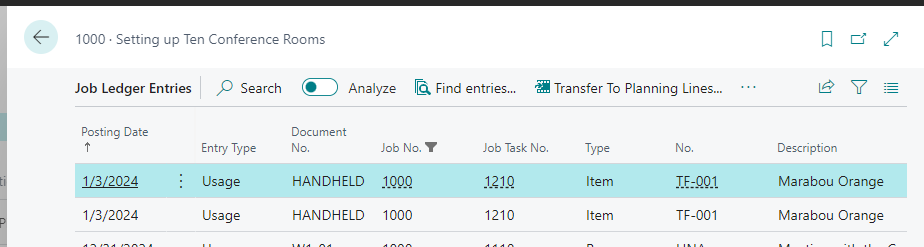
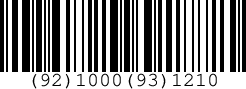

<h1>Job Journal Item Posting</h1>

This example show how to build a custom lookup and add-hoc functions to support select a Job and register positive and negative Item Consumptions.

Includes custom AL code and custom application.cfg file.

<h2>Setup:</h2>
When the App is installed, new Menu Items and Mobile Messages are created automatically.

You must manually setup the Job Journal Template and Batch Name along with the Job Line Type to use.

<h2>Screenshots:</h2>

New Menu Items on Main Screen

Lookup with Jobs

Job Journal Item Consumption

Result after posting

<h2>Example barcode GS1-128:</h2>

We use these custom AI´s
AI 92 = JOB
AI 93 = JOBTASK

