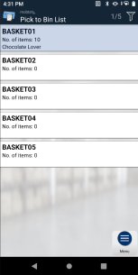
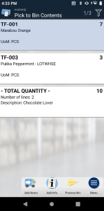
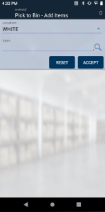
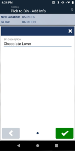
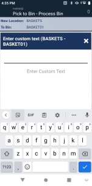
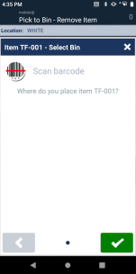

## Introduction
This Pick2Bin sample extension can be used as a starting point for a custom extension for Business Central solutions with Mobile WMS.

The extension makes it easy to pick and move items to a specific bin for further processing. This could be used to gather different items in a "basket" created as a bin in Business Central. The bin can then be processed as a collection of items. All transactions are done online so each item added to the bin is moved like posting an unplanned move and creates Item Ledger Entries and Warehouse Entries in Business Central.

### Use case examples
A salesperson goes through the warehouse with a customer and picks items to be sold to the customer. The final processing could then be creating a sales order and posting the shipment. The contents could also be transferred to a Point-Of-Sale solution for payments for cash customers.

A quality assurance employee goes through the warehouse and pick defect or expired products. The final processing could then be a negative adjustment and the necessary documentation of the scraped items. The contents could also result in a purchase return order.

It is important to notice that the processing will typically need to insure the items are removed from the bin so it can be used again.

### Demo
Please view this for a quick demo of the sample extension: https://vimeo.com/838599704/bdadc6796e

In the demo the items are collected to bins on the BASKETS location. The items are picked from the WHITE location as this is the default location for the user.

## How-to get started
This documentation assumes you are experienced making customizations to Mobile WMS or have been through the technical training for Business Central developers at Tasklet University.

### Configuration file
The extension contains several new pages for the mobile device and they need to be configured in the Application.cfg file on the device. The Configuration folder contains two files:

| File Name  | Description |
| ------------- | ------------- |
| application.cfg | An example file containing the main Pick2Bin page in the menu and all the Pick2Bin pages in the pages section. Everything related to Pick2Bin can be found by searching X02. |
| Version 1.8.0 - application-nav-bc.cfg  | The standard application.cfg for version 1.8.0 of the mobile app. Can be used as an alternative method to find the differences by comparing the two files. |

Please visit https://docs.taskletfactory.com/display/TFSK/Mobile+Configuration+Files for more information.

### Object numbers and prefix
The sample extension can either be used independently or be included in an existing extension. 

The sample extension is using codeunit 50000 to 50009 and the tag X02 so it will almost always be necessary to renumber and rename the objects before using the sample code at a production environment.

### Destination location
Mobile WMS normally uses the location configured as the warehouse employee's default location. This can often not be used for Pick2Bin if it for example is used for creating an adhoc sales order, as most Mobile WMS locations require picking for sales orders. This would then require picking the items twice.

It can therefor be necessary to create a new location without the need for picks. 

To use the sample extension directly you will need to create a new location called BASKETS with "Bin Mandatory" = true and create some bins and setup Inventory Posting Setup for it.

This hardcoded solution is not recommended in a real extension and you should adjust the code in the "X02 Lookup PickToBin List" codeunit to find the proper destination location. If you search for TODO you will quickly find where to add the proper code.

### Processing the bin
The "X02 PickToBin Process Bin" codeunit receives the bin but doesn't actual do any processing in the sample extension. This is where you will need to add code to process the contents of the bin. You can find inspiration in the "X02 PickToBin Remove Item" codeunit to find detailed bin contents including item tracking.

## Pages
### PickToBinList

This is the main page of Pick2Bin and is available directly on the main menu.

It shows a list of bins for the destination location. For each bin it shows the bin description that can be used to indicate it is in use by another employee.

Clicking a bin opens the PickToBinContents page, but you can also add a barcode to a physical basket with the bin code and thereby quickly open the bin.

This page is handled by the "X02 Lookup PickToBin List" codeunit.

### PickToBinContents

This page show the contents of the bin grouped per item no. It also adds a footer line with totals for the bin. The footer can i.e. be customized to show total weight or sales amount or inventory value.

Clicking a line opens the PickToBinRemoveItem page to remove an item from the bin.

From here you can also open these pages:
* PickToBinAddItems to add items
* PickToBinAddInfo to set a bin description
* PickToBinProcessBin to process the bin

This page is handled by the "X02 Lookup PickToBin Contents" codeunit.

### PickToBinAddItems

This page lets the user enter or scan any item to be added to the bin. Any additional information (bin code and item tracking and quantity) will be collected as steps. The user can select another location if the items isn't picked from the default location.

The user stays in the page ready for adding additional items after each item is added to the bin. Once completed the Back buttons brings the user back to the PickToBinContents

This page is handled by the "X02 PickToBin Add Items" codeunit.

### PickToBinAddInfo

This page enables the user to change the description of the bin.

This page is handled by the "X02 PickToBin Add Info" codeunit.

### PickToBinProcessBin

This page enables the user to get Business Central to process the bin. This is where you will need to add code to process the contents of the bin. You can find inspiration in the "X02 PickToBin Remove Item" codeunit to find detailed bin contents including item tracking.

This page is handled by the "X02 PickToBin Process Bin" codeunit.

### PickToBinRemoveItem

This page allows the user to remove an item from the bin. The user will need to specify where the item is relocated as the original bin is not saved and the item could have been picked from several bins.

This page is handled by the "X02 PickToBin Remove Item" codeunit.

## Disclaimer
The sample extension is provided as-is so please carefully validate and test the code and any solution made with the code. The code is not supported to the same degree as Mobile WMS but it is expected periodically to be kept up to date if future changes in Business Central or Mobile WMS requires it.

Please report bugs in the sample extension directly in GitHub.